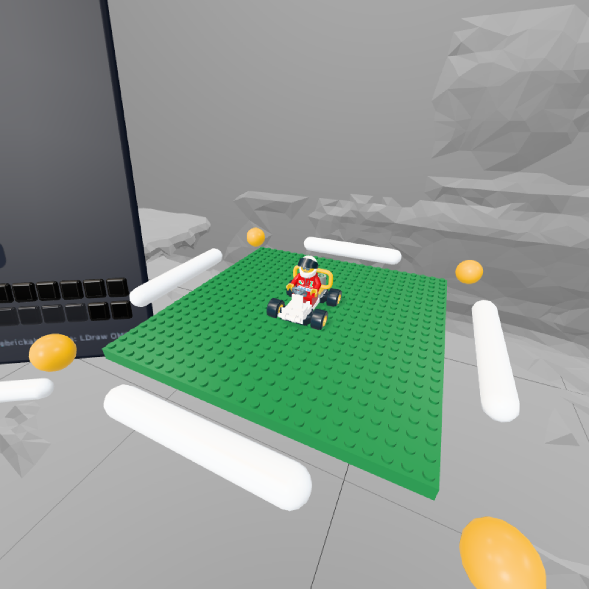

# Stacker

A mixed-reality brick-building app for Meta Quest 3, built for the browser. Build on a floating platform in your own room with real LDraw parts, using hands or controllers, and follow official kits step by step.



- **App:** [`app/`](app): an IWSDK (WebXR + Three.js) project
- **Data pipeline:** [`tools/`](tools) converts LDraw parts, Rebrickable data and LDraw models into the app's parts, colors and kits
- **Docs:** [`docs/`](docs/README.md): vision, architecture, interaction, pipeline, kits, rendering, development, decisions

## Quick start

```bash
cd app
npm install
npx iwsdk dev up
```

See [docs/07-development.md](docs/07-development.md) for testing on a Quest, emulator tests, and deploying.

## License

Stacker's code is licensed under the [GNU General Public License v3.0 or later](LICENSE).

The bundled part data keeps its own licenses: part geometry derived from the LDraw Parts Library is CC BY 4.0 (some parts CCAL 2.0), and the kit models from the LDraw Official Model Repository are CCAL 2.0. See [app/public/CREDITS.txt](app/public/CREDITS.txt).

## Credits

Parts from the [LDraw Parts Library](https://www.ldraw.org) (CC BY 4.0). Part-usage data from [Rebrickable](https://rebrickable.com). Kits from the LDraw Official Model Repository (CCAL 2.0). LEGO® is a trademark of the LEGO Group, which does not sponsor or endorse this project.
