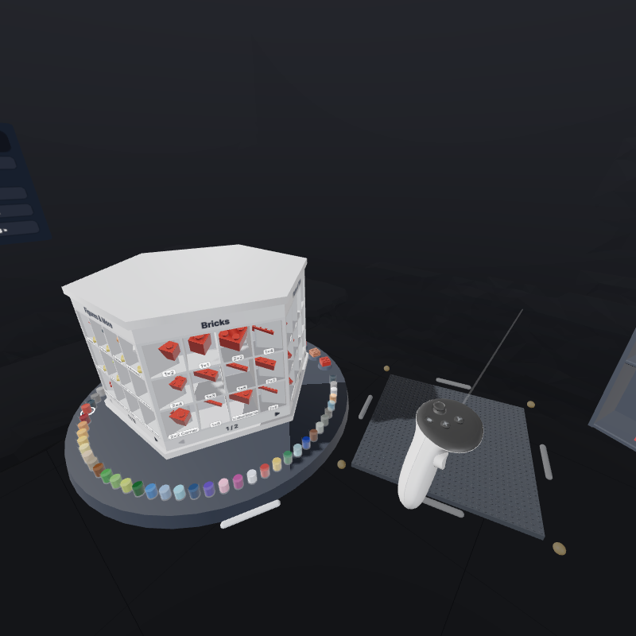

# 03 · Interaction

Stacker does its own input handling on top of IWSDK's raw input: controller poses and buttons from `this.input.xr.gamepads`, and hand joints straight from WebXR (`XRFrame.getJointPose`). IWSDK's own grab system, pointer rays and touch pointers are disabled so there's exactly one interaction model.

## Controls cheat sheet

| Action | Controller | Hand |
|---|---|---|
| Grab (near) | Grip or trigger near a block | Pinch (thumb + index) near a block |
| Grab (far) | Point the laser, then grip/trigger | Point, then pinch |
| Press a button / tab / swatch | Point + trigger (or grip) | Poke with index finger, or point + pinch |
| Duplicate what you're pointing at | Hold A / X — carry — let go to place. Or hold A / X and squeeze grip: the copy is held by the grip, so you can let go of A and turn it with the stick | Hold thumb + middle-finger pinch |
| Select | Hold B / Y and pull the trigger on blocks (keep the trigger held and sweep to select more; on a selected block it deselects). The outline turns cyan while B / Y is held | Select tool |
| Delete | Tap B / Y on a block (deletes on release), or press it while holding · or drop it on the parts shelf | Drop it on the parts shelf (it turns red) |
| Turn held block 90° | Thumbstick left / right (about the platform's up) | Rotate your wrist |
| Tip held block 90° | Thumbstick up / down (about the platform axis nearest your controller's side) | Rotate your wrist |
| Tools, undo / redo, saves | Turn your left palm up: the wrist menu | Same |
| Pick a part | Grab it from its cubby on the parts shelf | Pinch it |
| Spin the parts shelf | Grab its top or bottom cap and swipe sideways · or tap a side face's sign | Same, pinching |
| Color · finish | Dip the controller tip into a paint jar · touch a sample tile (or ray-press either) | Dip a fingertip · touch a tile |
| Box your build | Grab the camera on top of the kit rack, aim, A/X (or trigger) | Hold it, poke its red button with the other hand |
| Dim the lights | Reach up to the bulb above you and pull its cord down (grab the bead) | Pinch the bead and pull |
| Move platform / tilt it | Grab a white edge bar | Pinch an edge bar |
| Turn / scale platform | Hold an edge bar, grab a second edge (or the plate) with the other hand: turn your hands around each other, spread or close them | Same, with two pinches |
| Resize platform | Grab a yellow corner | Pinch a yellow corner |
| Move a panel or the kit shelf | Grab its white bar underneath | Pinch its bar |
| Drag a slider | Point + hold trigger, sweep | Touch and slide, or pinch-drag |

Destructive buttons ask for a second tap within 3 s: **Clear**, **Stress** (when there's a build), and starting a **kit** over a build.

## Desktop (mouse + keyboard)

The splash screen offers **Explore on this computer**: an orbit camera around the platform, panels standing behind it, and the cursor as the right hand (`desktop.ts`, read in `readMouse`). Outside XR there's no passthrough, so the preset's backdrop fills in.

| Action | Mouse / keys |
|---|---|
| Press buttons, pick a part, grab | Click / drag (left) |
| Duplicate | Alt + drag |
| Select | Shift + click (any tool) |
| Turn / tip the held block | Q E or ← → / ↑ ↓ |
| Delete | Delete or Backspace (hovered block, selection, or what's held) |
| Tools | 1 Build · 2 Select · 3 Paint |
| Undo / redo | ⌘/Ctrl + Z, add Shift to redo |
| Orbit / pan / zoom | Right-drag / Shift + right-drag or middle-drag / wheel |
| Frame the platform | F |

A carried block sits on whatever is under the cursor — a placed block or the plate — and the normal snap takes it from there. Over the parts shelf, it follows the cursor onto it (letting go removes it). Presses aim where the button went down, so a quick drag still grabs what was under the cursor.

## Input model

Each hand has a `HandState`:

- `mode`: `controller`, `hand`, or `none` (switching modes drops what's held)
- `rayOrigin`/`rayDir` from IWSDK's target-ray space
- `point`: the near-grab point — 3.5 cm out along the controller ray, or the midpoint between thumb and index tips
- `down`/`up`: button edges this frame — `squeeze`, `trigger`, `a`, `b` (controllers and mouse), `pinch`, `mid` (hands). Pinches use hysteresis (on < 18 mm, off > 30 mm). The middle-finger pinch (duplicate) only counts with the index finger clearly open (> 40 mm) and the middle tip within 15 mm

### Hand tracking details

- **Steady aim.** The hand's pointing ray is smoothed (small jitter damped, deliberate moves followed at once). While the fingers close fast toward a pinch, the ray and the target are held still for 150 ms, so the pinch itself doesn't knock the aim off what you meant.
- **Pinch ring.** A small ring between thumb and index shrinks as they close and fills blue on the pinch — white when something is targeted.
- **Letting go.** Once the pinch opens past 22 mm, the held block stops following the fingers, and release commits the landing that was on show (per-hand snap cache) rather than recomputing it.
- **Tracking loss.** A hand dropping out of tracking mid-hold keeps its pieces still for 0.3 s; if it's back and still pinching, the hold continues. Otherwise the pieces are parked where they are — never snapped somewhere you didn't choose.
- **Poke.** A press needs the fingertip to arrive from in front of the panel (armed above 6 mm) and reach the surface (4 mm; buttons sit at 1 mm). Sliding in from the side or from behind doesn't fire. Presses by hand or mouse play a soft tick (no haptics there).
- `holdButton`: whichever button started a hold; releasing *that* button ends it (so hold-A-to-duplicate releases on A). Squeezing grip (or trigger) while holding a duplicate on A hands the hold to that button
- `held`: buttons down right now, for modifiers: A/X held + grip duplicates; B/Y held turns trigger/grip into select (`selectSweep` adds or removes blocks swept over). B/Y only deletes when it's released without having selected anything (`bArmed`)

## Targeting

Each frame, if the hand isn't busy, `findTarget` runs **near first, then far**:

- **Near** (within 4 cm for controllers, 2.8 cm for hands): point-to-box distance against every candidate
- **Far** (ray, up to 4 m): ray-vs-box against the same candidates

Candidates: platform edge bars and corners, panel bars and resize handles, the shelf bar, every panel item (buttons, tabs, sliders, swatches, grid cells), loose blocks, and placed blocks. Placed blocks are tested in platform space where they're axis-aligned boxes (free-placed ones via their inverse matrix). A panel's surface blocks rays to anything behind it.

The target gets a white shell outline (tinted with the paint color in Paint mode). A thin laser and cursor show only when pointing far.

## Carrying blocks

A carry is a list of **pieces**; `pieces[0]` is the anchor. Every other piece stores its offset from the anchor (`offPos`/`offQuat` for display; `d2x`, `d2z`, `dl` in grid terms for snapping). A single block is just a one-piece carry, so groups and minifigs use the same code.

- **Controllers** keep the block's rotation relative to the controller from when it was grabbed; far grabs hold it 8 cm out along the ray. The first thumbstick flick **squares the block to the platform** (`turnAligned`): its rotation in the platform's frame rounds to the nearest whole quarter turns (`squareUp`), and from then on the wrist no longer turns it, only the stick. Left/right spins it a quarter turn about the platform's up; up/down tips it about the platform's X or Z axis, whichever is nearer the controller's side, so tipping away always tips away from you. While squared up, a small axis guide sits on the block (platform X red, Y green, Z blue), and each turn flashes a ring around its axis in that axis's color. Because the block is already on whole quarter turns, the snap lands it exactly as shown.
- **Mouse** holds keep a world rotation; Q/E and the arrows turn it the same way.
- **Hands** keep the grip where it was taken (far grabs fly to the pinch point) and follow the wrist's full rotation, smoothed harder than controllers to hide tracking jitter.
- Grabbing a placed block removes it from its batch and spawns a loose mesh at the same pose.

## Snapping (`computeSnap`)

Snapping is connector-based: each part's studs and sockets (from `parts.json` `conn`) are indexed in a spatial hash, and candidate landings align a carried connector with a facing one nearby, rejected when oriented boxes collide. It's recomputed only when the held pieces move more than 0.5 mm / 0.6° or the build changes. The steps below describe the kit magnet and the placement rules on top.

Given the carried pieces, find where they'd land. The result is one `Placement` (a full transform) per piece; the preview ghost (light blue) is drawn there each frame, and releasing animates the pieces into those spots over 70 ms.

1. **Kit magnet.** If a kit is active and you're carrying one piece, the nearest unfilled ghost of the same part and color within **6 cm** wins outright — including its exact position and angle.
2. **Connector candidates.** Every stud and socket on the carried pieces looks for a facing connector of the other type within reach (≈ a stud pitch; baseplate studs count). Each pairing proposes a pose: turn the piece so the connectors face, spin it to the nearest quarter turn of the target block, translate. Downward sockets also look a few centimeters below (0–4.8 cm), as if the piece had been let go and settled onto studs underneath.
3. **Joint candidates.** A joint *top* (hinge top, turntable top, glass, pane, shutter) proposes going exactly onto each nearby base's matching mount (see below).
4. **Pick.** Candidates are ranked by how far they'd move the held piece (`moveCost`): sliding sideways costs full price, settling straight down about a third (that's where it would fall), popping up the most. The best 24 distinct ones are tried; any whose oriented boxes collide with nearby blocks (or sink into the plate) are dropped. The winner engages the most connectors, then moves the piece least. So a block hovering over a gap (a hole in a floor, a slot in a wall, a well) drops into it instead of hopping sideways onto the blocks around it, while one held over a block still stacks on it. Before this, ranking by connector distance made the drop look farther than a sideways hop, and the 16 tried were often all neighbours' studs.
5. Hats and hair (`overlap` parts) never collide.

Heights are counted in **half plates** (4 LDU): plate = 2, brick = 6, minifig legs = 10.

### Joints and mounts

Paired parts snap by joint rather than studs: a *top* goes onto one of its *base*'s mounts (`joint.mounts` in `parts.json`, from `tools/special-parts.json`; default a shared LDraw origin). Hinge tops and turntables go on their bases; glass, panes and shutters go into window frames (a 1×4×3 frame has two pane mounts and two shutter mounts, and a shutter holder takes a shutter on either side). When mounts share a spot, the one nearest the angle you're holding wins. A top may sit inside its partner's box, so that collision is ignored.

## Hinges (`startSwing`)

Parts listed in `tools/hinges.json` swing once placed: 1×2 hinges, swivel plates, hinge bricks, turntables, window panes, shutters and doors (garage doors in the Fire Station, for example). Each has a pivot, an axis and a range (±90° hinges, ±100° panes and doors, ±120° shutters; turntables turn freely).

- **Grab it** (or anything built onto it: the nearest hinge it's stud-connected to) and it turns about its axis, following your hand. By ray or mouse, it follows where the ray crosses the swing's plane. A yellow line shows the axis, it ticks every 15°, and it thumps at a stop.
- **What swings:** the hinged part plus everything connected to it through its studs, transitively. If that group is also fixed to the plate another way, the hinge is locked and the grab takes the piece off as usual.
- **Pull it off:** move more than 6 cm off the arc (out, or along the axis) and the swing lets go of the hinge; you're holding the piece you grabbed, detached.
- Hinged parts win targeting within 1 cm of an enclosing part, so panes and doors can be grabbed inside their frames.
- A swing is one undo step. The angle for the stops is counted from where the part was placed (it resets on reload).

## Releasing

- Over the **parts shelf** → the pieces poof (deleted). The shelf's frame tints red while a held block is over it.
- If `computeSnap` succeeds → cells are reserved immediately (so the other hand can't take them mid-animation), the pieces animate in, then move into their instanced batch, and the kit checks for a match.
- Otherwise they stay **parked** in the air where you let go.

## Tools

| Tool | Trigger/pinch on a block | Grip on a block | A / X | B / Y |
|---|---|---|---|---|
| **Build** | grab | grab | duplicate & carry (hold A + grip: carry on the grip) | tap: delete · hold + trigger: select |
| **Select** | toggle selection (cyan outline) | grab the whole selection | duplicate the selection | delete the selection |
| **Paint** | recolor; keep holding and sweep to paint more | recolor / sweep | duplicate | delete |

In any tool, grabbing a selected block carries the whole selection, keeping its shape and re-selecting it once placed. Tapping a swatch while blocks are selected recolors them.

**Undo** keeps 50 steps. Whenever an edit settles — nothing held, painting or animating — the state from before it (placed blocks + plate bounds, as JSON) goes on the stack, so a whole drag, sweep-paint or group move is one step. It's off during kits (kit progress isn't part of the snapshot); leaving a kit is one undoable step.

## Platform, panels, shelf

Handles are small and translucent (55%) until a hand points at one. Platform edge and corner handles yield to blocks: a block within 1.2 cm (near) or 3 cm (by ray) wins the grab.

- **Edge bars** attach the platform rigidly to your hand (6DoF), so you can move and tilt it. If released within 7° of level, it eases back to level.
- **Two hands** (`tickTwoHand`): while one hand holds an edge bar, the other can grab another edge bar or anywhere on the plate. The platform then follows the hands' midpoint, turns about up as they turn around each other (it never tilts), and scales with the distance between them (0.75×–3×, a haptic tick every 0.25×). A white line joins the two grabs. Letting go with one hand settles the scale on the Size slider's 0.05 steps and the other hand carries on alone, without a jump. The plate surface is only a handle for the second hand, so a missed grab while building never moves the platform.
- **Corner handles** move two edges in whole studs, 4–64 per side, never shrinking past what's built. The opposite corner stays put.
- **Size slider** scales the platform (and loose blocks) around the plate center, 0.75×–3×. Handles counter-scale so they stay the same size in your hand.
- **Parts shelf** — bar at the front of its base to move it. **Wrist menu** — follows your left hand (below).
- **Settings** — bar to move. See [06](06-rendering-and-performance.md).
- **Kit shelf / manual** — bars to move. See [05](05-kits.md).

## Lamp

A light bulb hangs up and to your right (`lamp.ts`, placed with the panels; on the desktop it's above the plate). Grab the wooden bead on its cord, near, by ray or with the mouse, and pull down: the cord stretches with your hand, and past 5 cm it clicks (sound and haptics) and steps the room's lights to the next level, **100% → 60% → 30% →** back to 100%. Let the cord back up a little and you can pull again without letting go. Letting go springs it back.

The level scales the key light, the fill and the environment reflections (on top of the look preset and sliders) and eases over a moment; the bulb's own glow follows it. It's saved with the look settings.

## Parts shelf

A six-sided drum of cubbies floating over a round base, to the left of the platform (`shelf.ts`; desktop: behind the plate's left side). It turns like a lazy Susan, one group of categories per face: **Bricks · Plates & Tiles · Slopes & Curves · Round · Windows & Special · Figures & More** (the six minifig presets come first on the last face). Its front face turns toward where you stand.

- **Pick a part:** grab it out of its cubby (near or by ray, or click-drag on the desktop); it comes out full size in your hand. The part under your pointer turns slowly
- **Turn the drum:** grab the top or bottom cap and swipe sideways; it follows your hand and settles on the nearest face, ticking as faces pass. Or tap the sign on a side face and it turns there
- **More parts:** faces with more than 12 parts page with ◀ ▶ on their bottom band
- **Colors:** a ring of paint jars round the base's front, one per palette color (see-through colors in clear jars). Dip the controller tip or a fingertip into one, or ray-press it, and every part in the cubbies takes that color; with a selection, it recolors the selection. The chosen jar sits up with a white ring
- **Finishes:** three sample bricks on the base's right (plastic, wood, clear), in the current color; touch one to switch
- **Delete:** let go of blocks (or one of your boxes) over the shelf; its frame turns red first
- Only the faces turned toward you get their parts drawn

## Wrist menu

Turn your left palm up (hands: from the knuckles; controllers: roll the left controller palm-up) and a small menu opens above your wrist, facing you: **Build · Select · Paint**, **Undo · Redo · Deselect**, **◀ Slot n ▶** with **Save · Load**, and during a kit **Exit kit · Restart · Skip**. Press it with the other hand (poke or ray). Turn your palm down and it closes. On the desktop it's docked by the shelf and always open.

## Settings → Controls

**Controls ▸** in Settings lists every gesture and button mapping for controllers and hands.
