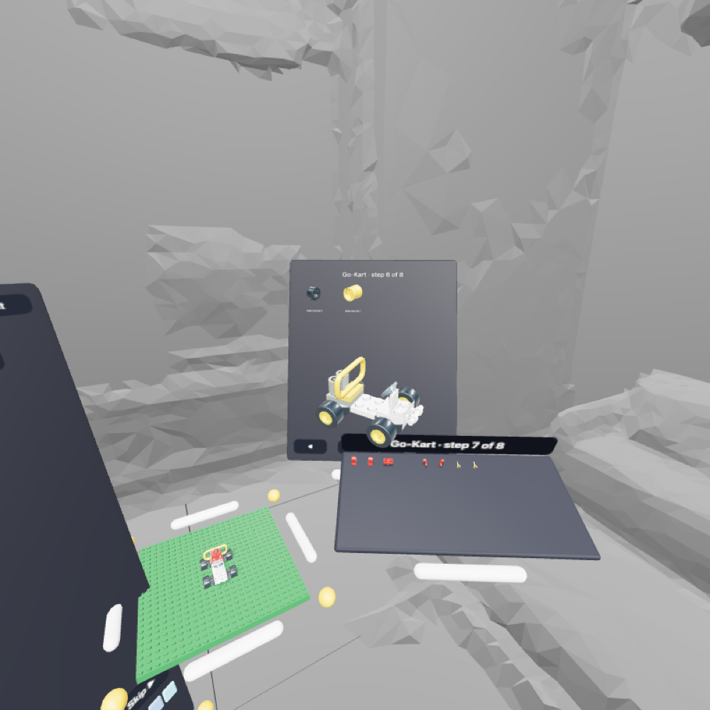

# 05 · Kits

A kit is an official model broken into steps. Stacker guides you through it with ghosts on the platform, a shelf holding each step's pieces, and optionally a paged manual.


## Current kits

| Kit | Source | Pieces | Steps | Notes |
|---|---|---|---|---|
| House | OMR 7796-1 (2008), by Merlijn Wissink | 56 | 13 | All grid parts; steps generated bottom-up |
| Go-Kart | OMR 6400-1 (1997) | 29 | 8 | Authored steps; wheels and the driver are free parts |
| Robot | OMR 7910-1 (2004) | 25 | 8 | Built at angles — every part is free |

Kits were found by scoring small sets (Rebrickable) for coverage by our parts and checking which exist in the [LDraw Official Model Repository](https://library.ldraw.org/omr/sets) (`https://library.ldraw.org/library/omr/<set>.mpd`).

## Converting a model (`tools/build-kit.py`)

```bash
python3 tools/build-kit.py collect data-src/*.mpd            # which parts/colors the kits need
python3 tools/build-kit.py build data-src/6400-1.mpd Go-Kart 6400-1
```

1. **Read** the `.mpd`; each `0 FILE` section is a sub-model. The first is the main model.
2. **Flatten** sub-models (e.g. the Go-Kart's driver) into parts, composing transforms and inheriting color 16. `0 STEP` lines in the main model set step numbers.
3. **Transform** each part: its baked center (from `parts.json`) is carried through the LDraw matrix, then into three.js axes: `T = (x, −y, −z)`, `R = F·M·F`.
4. **Classify:**
   - **Grid** if upright (`R[1][1] ≈ 1`) and its footprint lands on whole studs and whole half-plates → `{ i, j, level, turns, fw, fd }`
   - **Free** otherwise → `{ m: [R (9), T (3)] }` in LDU, model space
5. **Steps:** authored `STEP`s if present; otherwise bottom-up by height, 3–5 parts per step with small layers merged. Steps over 8 parts are split so the shelf stays manageable.

### Kit JSON

```json
{ "id": "6400-1", "title": "Go-Kart", "pieces": 29,
  "steps": [
    [ { "part": "6157", "color": 0, "i": -2, "j": 1, "level": 0, "turns": 2, "fw": 4, "fd": 2 },
      { "part": "30028", "color": 256, "m": [1,0,0, 0,1,0, 0,0,1, -42,9,-40] } ]
  ] }
```

## Running a kit

Starting a kit (Library → Kits → a kit):

1. Clears the platform, grows it if the model doesn't fit, and centers the model (`di`, `dj` lattice offset)
2. Builds the **shelf** and fills it with step 1's pieces
3. Adds a **ghost** per piece in the step

### Ghosts

- Edge-only (`EdgesGeometry`, 30° threshold), cyan, pulsing — they never hide what's under them
- Children of the platform, so they move/tilt/scale with it
- While you carry a kit piece, the **nearest matching ghost** (same part and color) turns yellow and a **yellow guide line** runs from the piece to it
- Within **6 cm** the piece jumps in exactly — position and angle. This is how free parts (wheels, arms, hinges) get placed, and why you never have to tilt a piece yourself
- Kit models are trusted: a ghost always accepts its piece even if bounding boxes overlap on the grid (e.g. wheel holders hanging below a plate)

### Matching and progress

- A placement fills a ghost if it was magnet-snapped to it, or if it lands on the same cell/level/footprint with the same part and color (rotation only matters for asymmetric parts — see `isSymmetric`)
- Filling every ghost in the step → chime → next step (shelf refills, new ghosts)
- Pulling a matched piece back off brings its ghost back
- **↺ Restart step** takes back everything placed this step and refills the shelf
- **Skip ▶** places the rest of the step for you
- **Exit kit** clears ghosts and the shelf (the build stays)

### Shelf

A tray to the right of the platform, tilted toward you, with a grab bar and a "Title · step n of N" label. Pieces are laid out in rows spaced by their real size, and stay attached to the tray as you move it until you pick them up.

### Instructions modes (Settings → Guide)

| Mode | Platform ghosts | Guide line | Manual |
|---|---|---|---|
| Ghosts (default) | ✓ | ✓ | — |
| Manual | hidden | — | ✓ |
| Both | ✓ | ✓ | ✓ |

The magnet stays on in every mode, so free parts can still be placed.



**Manual** is a movable panel:

- Title: "Kit · step n of N"
- Parts callout: up to 8 part/color groups with counts (e.g. "4×")
- A slowly turning miniature of the model **as built through that page's step**, with that step's new pieces outlined in yellow
- ◀ / ▶ page freely; the middle button jumps back to the step you're on; it follows along automatically when you complete a step

## Adding a kit

1. Find a small set with `tools/find-kits.py` (see [07](07-development.md#finding-kits))
2. Download the `.mpd` into `data-src/`
3. `python3 tools/build-kit.py collect data-src/*.mpd` → then rebuild colors and parts (new parts go to the More tab)
4. `python3 tools/build-kit.py build data-src/<set>.mpd <Title> <set>`
5. Add `{ id, title, pieces }` to `KITS` in `stacker-system.ts`
6. Test: `await s.startKit('<set>', '<Title>')` in the emulator, skip through, confirm the piece count
