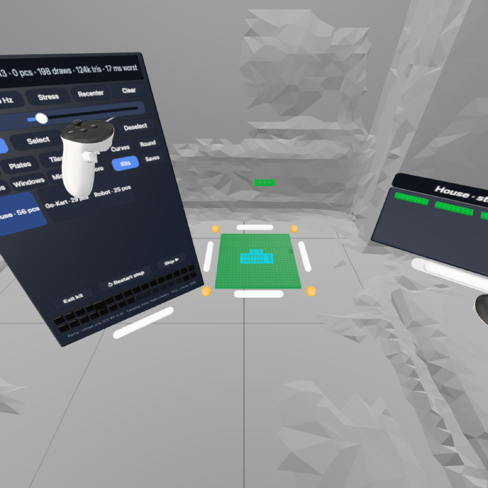
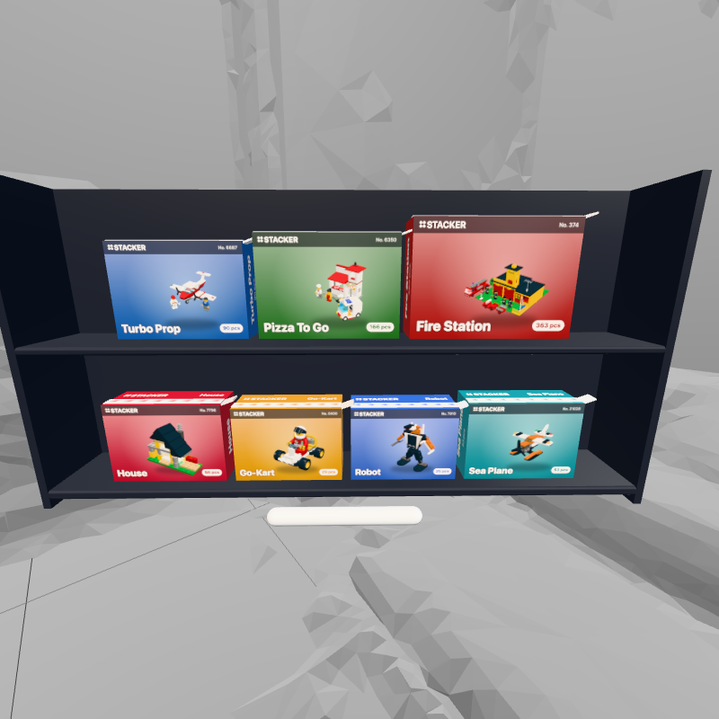
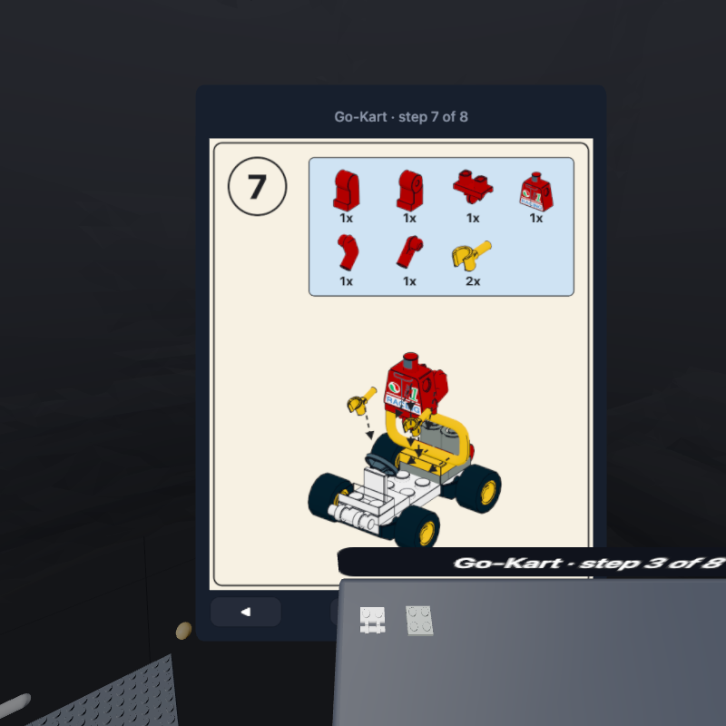

# 05 · Kits

A kit is an official model broken into steps. Stacker guides you through it with ghosts on the platform, a shelf holding each step's pieces, and optionally a paged manual.



## Current kits

| Kit | Source | Pieces | Steps | Notes |
|---|---|---|---|---|
| House | OMR 7796-1 (2008), by Merlijn Wissink | 56 | 13 | All grid parts; steps generated bottom-up |
| Go-Kart | OMR 6400-1 (1997) | 29 | 11 | Authored steps; wheels and the driver are free parts |
| Robot | OMR 7910-1 (2004) | 25 | 8 | Built at angles — every part is free |
| Sea Plane | OMR 31028-1 (2015) | 53 | 14 | Half-stud grid offset (auto-detected) |
| Turbo Prop | OMR 6687-1 (1987) | 90 | 29 | Plane plus two minifigs |
| Pizza To Go | OMR 6350-1 (1994) | 166 | 49 | Car and minifigs placed at 30°/60° (free parts) |
| Fire Station | OMR 374-1 (1978) | 363 | 95 | Includes its own 16×32 baseplate; logo flag swapped for a plain one |

To browse more candidates, the OMR list (1,470 models) can be joined with Rebrickable's `sets.csv`/`themes.csv` for names, years and piece counts. Technic models are a poor fit (pins and axles don't snap).

Kits were found by scoring small sets (Rebrickable) for coverage by our parts and checking which exist in the [LDraw Official Model Repository](https://library.ldraw.org/omr/sets) (`https://library.ldraw.org/library/omr/<set>.mpd`).

## Converting a model (`tools/build-kit.py`)

```bash
python3 tools/build-kit.py collect data-src/*.mpd            # which parts/colors the kits need
python3 tools/build-kit.py build data-src/6400-1.mpd Go-Kart 6400-1
```

1. **Read** the `.mpd`; each `0 FILE` section is a sub-model. The first is the main model.
2. **Flatten** sub-models (e.g. the Go-Kart's driver) into parts, composing transforms and inheriting color 16. `0 STEP` lines in the main model set step numbers.
3. **Transform** each part: its baked center (from `parts.json`) is carried through the LDraw matrix, then into three.js axes: `T = (x, −y, −z)`, `R = F·M·F`.
4. **Classify** (after finding the model's grid origin — the most common stud offset among upright parts — and its half-plate phase, with the base under the lowest part):
   - **Grid** if upright (`R[1][1] ≈ 1`) and its footprint lands on whole studs and whole half-plates → `{ i, j, level, turns, fw, fd }`
   - **Free** otherwise → `{ m: [R (9), T (3)] }` in LDU, model space
5. **Steps:** in the model's own order. Each sub-model that's an assembly of its own (it has `STEP`s, or more than 3 parts: a vehicle, a minifig) is built in its own steps where the model lists it, before its parent carries on; `STEP`s anywhere advance the step. Any step over 6 parts, and any model with no steps at all, is broken up bottom-up, 3–5 parts a step with small layers merged. So the Fire Station builds the ladder truck, then the chief's car, then the building, then the firefighters.

### Where the steps come from

The models are fan-made (OMR), not LEGO's booklets, so a kit's steps are only as good as what the modeller marked plus what the converter makes up. Each step records its `origin`:

| Origin | Meaning |
|---|---|
| `file` | Marked with `STEP` in the model file and kept as is |
| `auto` | Split bottom-up by `layered()` (steps over 6 parts, or models with no steps). It sorts by height and doesn't know what holds what, so a part can land a step before what it hangs from |
| `edit` | Regrouped in the catalog and saved to `tools/kit-edits/<id>.json` |

Every piece keeps `k`, its index in the model file. Catalog edits are stored as lists of `k`, so rebuilding a kit keeps them; pieces an edit doesn't mention (the model changed) go in a last step.

### Kit JSON

```json
{ "id": "6400-1", "title": "Go-Kart", "pieces": 29,
  "steps": [
    [ { "part": "6157", "color": 0, "k": 0, "i": -2, "j": 1, "level": 0, "turns": 2, "fw": 4, "fd": 2 },
      { "part": "30028", "color": 256, "k": 7, "m": [1,0,0, 0,1,0, 0,0,1, -42,9,-40] } ]
  ],
  "origin": ["file"] }
```

## Kit boxes



Every kit has a product box on a **rack** to the right of the platform (desktop view: behind the plate). Box art is rendered at startup from the kit's own model by a small throwaway WebGL context (`ArtRenderer` in `kit-boxes.ts`) — front from the front-right, back from the back-left, cropped to the model's projected bounds — so there's no packaging art to license and new kits get a box automatically. Box color comes from `KITS[].color`; size grows with the piece count.

1. **Grab a box** (squeeze/trigger/pinch, near or by ray; click-drag on desktop). From the rack or by ray it comes to your hand, front toward your eyes; turn your hand to read the back (pieces, steps).
2. **Let go** and it floats where you left it. Let go over the rack, or press **B** on it, and it goes back. Taking another box sends a floating one home.
3. **Tear the strip** on top: grab its tab (sticking out on the right) and pull ~9 cm in any direction. It ratchets with haptic ticks; let go early and it springs back. If there's a build on the plate a label warns that opening clears it (undo brings it back after the kit).
4. **Torn:** the box pops, the kit starts, and the parts shelf appears where the box was. The rack hides while a kit is running and returns, every box home, when it ends.

The Library's Kits tab still starts kits directly.

### Boxing your own build (the box camera)

A small camera sits on the rack's roof (`snap-camera.ts`). Grab it and its back screen is a viewfinder: your build, rendered the way box art is (`ArtRenderer.renderView` from the camera's pose, only the placed blocks, on the box's color), a few times a second, in a GL context of its own that's freed when you put the camera down.

- **Shutter:** A/X, or the trigger when you hold it by the grip; with hands, poke the red button with your other index finger; on the desktop, Space
- **What it makes:** a box of your own (`shootBox`): your shot on the front (`mine` boxes draw it as framed, without the floor shadow), the back rendered as usual, the build's most common color, "My build n". It pops out of the camera and flies to the rack's top tier, **Your builds** (newest first; ones that don't fit stay off the rack)
- **Inside:** your build as kit steps (`buildSteps`): every piece by its transform, bottom up, 3–5 a step. Tearing the strip opens it like any kit, so you (or anyone on that device) can rebuild it with ghosts and the manual
- **Stored** on the device in `localStorage` under `stacker.boxes` (photo as WebP, steps as kit blocks; finishes aren't kept)
- **Delete:** carry one of your boxes over the library (it turns red) and let go

## Running a kit

Starting a kit (a box, or Library → Kits → a kit):

1. Clears the platform, grows it if the model doesn't fit, and centers the model (`di`, `dj` lattice offset)
2. Builds the **shelf** and fills it with step 1's pieces
3. Adds a **ghost** per piece in the step

### Ghosts

- Edge-only (`EdgesGeometry`, 30° threshold), cyan, pulsing — they never hide what's under them
- Children of the platform, so they move/tilt/scale with it
- While you carry a kit piece, the **nearest matching ghost** (same part and color) turns yellow and a **yellow guide line** runs from the piece to it
- Within **6 cm** the piece jumps in exactly — position and angle. This is how free parts (wheels, arms, hinges) get placed, and why you never have to tilt a piece yourself
- Kit models are trusted: a ghost always accepts its piece even if bounding boxes overlap on the grid (e.g. wheel holders hanging below a plate)

### Build it your way

You don't have to finish a step to see the next one. Page to any step with **◀ ▶** on the kit shelf's label, on the wrist menu (left palm up), or on the manual: the pieces still on the shelf go back, that step's come out, and its ghosts show. Pieces you've taken off the shelf and parked stay where they are, and pieces can be placed anywhere, on a ghost or not.

- Each step remembers which of its pieces are done (`KitState.done`): a placement fills a ghost if it was magnet-snapped to it, or lands on the same cell/level/footprint with the same part and color (rotation only matters for asymmetric parts, see `isSymmetric`). Coming back to a step shows only what's left; a finished step says ✓
- Filling every ghost in the step you're on → chime → on to the next step with pieces left (wrapping round). The kit finishes when every step is done, in whatever order
- Pulling a matched piece back off reopens its ghost (shown if you're on that step)
- **↺ Restart** takes back everything placed for this step and refills the shelf
- **Place it** places the rest of this step for you
- **Exit kit** clears ghosts and the shelf (the build stays)

### Shelf

A tray to the right of the platform (or where the box was opened), tilted toward you, with a grab bar and a "Title · step n of N" label with ◀ ▶ at its ends. Pieces are laid out in rows spaced by their real size — anything bigger than 7.5 cm (baseplates) shrunk to fit, full size again once picked up — and stay attached to the tray as you move it until you pick them up.

### Instructions modes (Settings → Guide)

| Mode | Platform ghosts | Guide line | Manual |
|---|---|---|---|
| Ghosts (default) | ✓ | ✓ | — |
| Manual | hidden | — | ✓ |
| Both | ✓ | ✓ | ✓ |

The magnet stays on in every mode, so free parts can still be placed.



**Manual** is a movable panel drawn like a printed instruction booklet (a cream page with a frame), one page per step:

- A circled step number, and a blue callout top right with each part/color the step needs, drawn on its own with a count ("2x")
- The model built so far, flat and isometric: cel-shaded colors (three tones) with bold outlines (fat lines from each part's edges); near-black parts print dark grey with lighter outlines
- This step's parts float just above their spots along their own up axis, with dashed arrows down into place
- Small models are framed whole; once the model is much bigger than the step, the view zooms to the step's parts
- Pages are drawn by `ManualPainter` (`manual.ts`) in the same throwaway WebGL context as the box art (`ArtRenderer.renderIso`), kept while the manual is open. The catalog uses the same painter, so what you audit there is what the headset shows
- **−/+** zoom the page in on the step's parts (1×, 1.7×, 2.8×, 4.5×); line weight follows how big a stud is drawn, bold up close and fine when everything's small. Pages render at 2048 px wide.
- ◀ / ▶ change the step you're on (the shelf and ghosts follow); the middle button shows what's left, or jumps to the first step with pieces left

Large sets with steps spread across the model (Fire Station) still render small; the pages are only as good as the model's authored steps.

## Auditing kits (the catalog)

`catalog.html` (<https://stacker.view.fast/catalog.html>, or `/catalog.html` on the dev server) opens any kit step by step: the manual page, a 3D view, and what holds each piece when its step is built:

- **On the plate / On studs**: fine
- **Touching only**: attached some other way (hinges, clips, wheels on pins), amber in 3D
- **Floating**: nothing holds it yet, what it rests on comes in a later step, red in 3D. These are the steps that look wrong

On the dev server you can tick pieces and move them to the previous or next step, split a step, merge it with the next, or move it; **Save** writes `tools/kit-edits/<id>.json` and reruns `build-kit.py` (needs `data-src/<id>.mpd`). **Reset to generated** drops the edits. ✓ / ⚑ marks go to `app/public/catalog/review.json`. Full detail (every check, how floating is worked out, known limits): [09 · Catalog & audit](09-catalog.md).

## Adding a kit

1. Find a small set with `tools/find-kits.py` (see [07](07-development.md#finding-kits))
2. Download the `.mpd` into `data-src/`
3. `python3 tools/build-kit.py collect data-src/*.mpd` → then rebuild colors and parts (new parts go to the More tab)
4. `python3 tools/build-kit.py build data-src/<set>.mpd <Title> <set>`
5. Add `{ id, title, pieces, color }` to `KITS` in `kits.ts` (its box appears on the rack)
6. Test: `await s.startKit('<set>', '<Title>')` in the emulator, skip through, confirm the piece count; `python3 dev/tests/test_boxes.py` for the box flow. Then open it in the catalog and fix any floating steps
7. Logo-printed parts: map them to their plain version in `PLAIN` in `build-kit.py`
