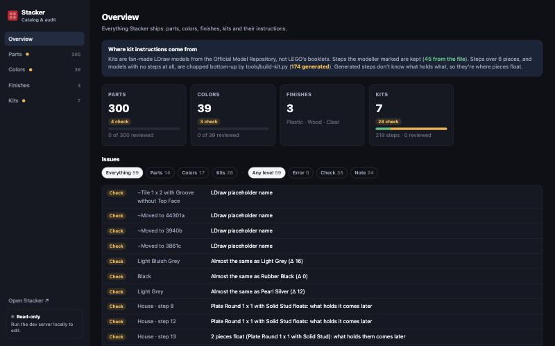
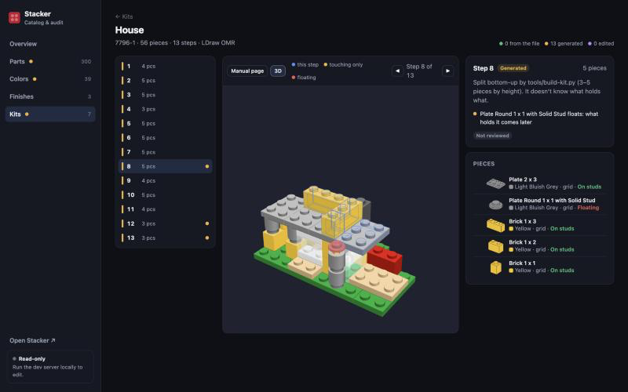

# 09 · Catalog & audit

The catalog is a web page for looking over everything Stacker ships (parts, colors, finishes, kits and their instructions), checking it for problems, and fixing what can be fixed without touching code.



| Where | Mode |
|---|---|
| <https://stacker.view.fast/catalog.html> | Read-only: browse, audit, see review marks |
| `https://localhost:3129/catalog.html` (dev server, `npx iwsdk dev up`) | Editing: part names and tabs, kit steps, review marks |

It's a second page of the same Vite app, not a separate tool: it loads the app's own `parts.bin`, kit files, finishes and manual renderer, so a part, color or manual page looks exactly as it does in the headset.

## Views

Routes live in the URL hash, so any view can be linked: `#/parts/3004`, `#/colors/4`, `#/kits/374-1/12`.

| View | What it shows |
|---|---|
| **Overview** `#/overview` | Where kit steps come from (authored vs generated counts), a card per area with problem counts and review progress, and one filterable list of every issue (by area and level). Click an issue to jump to it |
| **Parts** `#/parts/<id>` | Every part as a product-shot thumbnail. Filter by library tab, search name or id, show only parts with problems / not reviewed / flagged, pick the thumbnail color. The detail panel has an orbitable 3D view with connectors (green studs, orange sockets), footprint, connector and triangle counts, joints and hinges, which kits use it (links to the first step), its audit issues and review mark |
| **Colors** `#/colors/<code>` | Every palette color: swatch (checkered for see-through), a 2×4 brick rendered in it, LDraw code, hex, how many kit pieces use it. Detail: 3D brick, kits using it, issues, review |
| **Finishes** `#/finishes` | Plastic, Wood and Clear, each on a 2×4 brick in eight colors, with what makes each one (from `look.ts`). Read-only: finishes are code |
| **Kits** `#/kits` | A card per kit: model render on its box color, pieces and steps, a bar of step origins (from the file / generated / edited), problem count, floating pieces, review progress |
| **Kit** `#/kits/<id>/<step>` | The instructions step by step (below) |

### Auditing a kit



- **Step rail** (left): every step with its origin as a colored bar (green from the file, amber generated, purple edited), piece count, review mark and a dot if something's wrong. **←/→** (or ↑/↓) move between steps
- **Stage** (center): **Manual page** is the booklet page drawn by `ManualPainter`, the same code the headset's manual panel uses, with its zoom levels. **3D** shows the model through this step: this step's pieces outlined in blue, anything only touching tinted amber, anything floating tinted red. The camera frames the whole model so it holds still while you step
- **Side panel** (right): the step's origin and what it means, its issues, the review control, and every piece with its part, color, grid or free placement, and how it's held

How each piece is held when its step is built:

| Hold | Meaning |
|---|---|
| On the plate | Its bottom is within a plate (8 LDU) of the model's lowest point |
| On studs | A stud and socket meet, facing each other, with something already built |
| Touching only | Its box overlaps something already built, but no stud connection: hinges, clips, wheels on pins, stickers |
| Floating | Nothing holds it yet. What it rests on comes in a later step: the steps that look wrong |
| Missing part | The part isn't in the library |

## Audit checks

Everything is computed in the browser from the shipped files (`app/src/catalog/audit.ts`). Levels: **Error** (broken), **Check** (probably wrong, look at it), **Note** (worth knowing).

| Area | Level | Check | Rule |
|---|---|---|---|
| Parts | Check | Can't snap | No studs or sockets, no joint, and not a minifig part |
| Parts | Check | Unused extra | In the More tab (added for kits) but no kit uses it |
| Parts | Check | Duplicate name | Another part has the same name |
| Parts | Check | Placeholder name | Name starts with `~` or `_`, or says "obsolete" / "moved to" (renamed LDraw files) |
| Parts | Note | Heavy | Over 4,000 triangles |
| Colors | Check | Near-duplicate | Same opacity and RGB distance under 24 |
| Colors | Note | Library only | No kit uses it |
| Kits | Error | Missing part | A piece's part isn't in `parts.json` |
| Kits | Error | Missing color | A piece's color isn't in `colors.json` |
| Kits | Error | Duplicate piece | Same part, color and transform as another piece |
| Kits | Check | Count mismatch | `KITS` in `kits.ts` says a different piece count than the file |
| Kits | Check | Floating pieces | One issue per step listing the pieces that float |

### How floating is worked out (`analyzeKit`)

1. Each piece becomes a world matrix (`kitPiece`), a bounding box, and its connectors transformed into model space.
2. **Stud links:** connectors are hashed by position rounded to 1 LDU. A stud (type 0) and a socket (type 1) of two different pieces at the same spot, pointing opposite ways (dot < −0.9), link those pieces.
3. **Touch links:** bounding boxes pulled in by 1 LDU on every side, so pieces merely side by side don't count. Paper-thin parts (under 2 LDU, stickers) are pushed out 0.5 LDU instead and tested against the other piece's full box.
4. **Ground:** within 8 LDU of the lowest point of any piece in the model.
5. **Per step:** everything from earlier steps counts as built (even if it floated then). Pieces in the step settle in two passes: first ground and studs only, repeated until nothing changes (so a stack built in one step holds itself up), then touch links. Whatever is left floats.
6. **Duplicates:** part, color and matrix rounded to 1e-5.

### Known limits

- **Sub-assemblies:** the first step of something real booklets build in your hand (a truck chassis, a minifig's legs) is flagged, because in Stacker it hangs in mid-air above the platform. Sometimes that's the point (Stacker has no "in hand"), sometimes it's noise
- **Boxes, not shapes:** touch uses axis-aligned bounding boxes, so a rotated or oddly shaped part can look like it touches something it doesn't
- **Only studs link:** pins, axles, clips, bars and hinges have no connectors in `parts.json`, so those attachments read as touching only
- **Models that float:** some OMR models genuinely have pieces nothing touches (Pizza To Go's chef stands in mid-air); the audit is right, the model is odd
- **Whole-model ground:** a model whose lowest part isn't its base (Pizza To Go's tyres sit below its baseplate) flags the baseplate

## Editing (dev server only)

The **Editing on** badge in the sidebar means the page found the dev-server API. On the deployed site the check fails and every edit control is hidden.

| What | How | Writes |
|---|---|---|
| Part name and library tab | Part detail → edit → Save | The part's entry in whichever list defines it (`tools/special-parts.json`, `selection.json`, `kit-parts.json` or `minifigs.json`), and the same fields in `app/public/parts/parts.json` so nothing needs rebuilding |
| Kit steps | Tick pieces in the side panel, then: **To previous step**, **To next step**, **New step before**, **Split off after**; per step: **Merge with next**, **Move step earlier / later**. Changes stay local (undo with ⌘Z or **Undo**, **Discard**) until **Save** | `tools/kit-edits/<id>.json`, then reruns `tools/build-kit.py build` so `app/public/kits/<id>.json` is regenerated (needs `data-src/<id>.mpd`) |
| Back to generated steps | **Reset to generated** (kit header, only when the kit has edits) | Deletes `tools/kit-edits/<id>.json` and rebuilds |
| Review marks | **✓ Looks right** / **⚑ Flag** (+ a note) on any part, color or kit step; click again to clear | `app/public/catalog/review.json`, saved on every change |

Everything lands as ordinary files in the repo: check `git diff`, then commit and deploy as usual. Rebuilding parts (`build-parts.mjs`) keeps name and tab edits because they're made in the source lists.

### Dev-server API (`app/catalog-api.ts`)

A Vite plugin with `apply: 'serve'`, so it never exists in the production build. It answers only requests from this machine (loopback addresses); anything else gets 403, even though the dev server listens on the LAN for the Quest.

| Request | Body | Does |
|---|---|---|
| `GET /__catalog/ping` | | `{ ok, edit: true }`: how the page knows it can edit |
| `POST /__catalog/part` | `{ id, name, tab }` | Renames / re-tabs a part |
| `POST /__catalog/kit` | `{ id, title, steps: number[][] }` | Saves a step grouping (every piece `k` exactly once) and rebuilds |
| `POST /__catalog/kit-reset` | `{ id, title }` | Drops the edits and rebuilds |
| `POST /__catalog/review` | `{ parts, colors, kits }` | Replaces `review.json` |

Inputs are validated (ids `[A-Za-z0-9._-]`, tabs from `TABS`, titles, every kit piece accounted for). The `tools/` JSON files are written in the same format Python writes them (1-space indent, non-ASCII escaped), so an edit shows as a one-line diff.

### File formats

`tools/kit-edits/<id>.json`: steps as lists of piece ids (`k`, the piece's index in the model file):

```json
{ "steps": [[0, 1, 2, 3], [4, 5, 6, 7, 8], [29, 37, 39, 43, 51]] }
```

`build-kit.py` applies it after its own grouping. A step whose pieces match a generated step keeps that step's origin (`file` or `auto`); any other becomes `edit`. Pieces the file doesn't mention (the model changed) go in a last step, with a warning.

`app/public/catalog/review.json`: marks keyed by part id, color code and, for kit steps, the step's piece ids joined with commas. Regrouping a step changes its key, so its mark clears: an edited step needs reviewing again.

```json
{ "parts": { "3004": { "s": "ok" } },
  "colors": { "0": { "s": "flag", "note": "Same as Rubber Black" } },
  "kits": { "7796-1": { "steps": { "33,34,35,36": { "s": "ok" } } } } }
```

## Code

| File | What |
|---|---|
| `app/catalog.html` | Page shell and all styles (tokens on `:root`, light and dark) |
| `app/src/catalog/main.ts` | Boot, hash router, sidebar; `window.catalog` is the context, for poking at in devtools |
| `app/src/catalog/data.ts` | Loads the library, kits, `review.json` and the edit check; the `api()` client |
| `app/src/catalog/audit.ts` | Every check, `analyzeKit` (holds, duplicates), usage counts |
| `app/src/catalog/render.ts` | `Materials` (the app's finishes), `Thumbnailer` (box-art renderer, one at a time, cached), `lazyImg`, `Viewer` (orbit view of a part or a kit step) |
| `app/src/catalog/views.ts` | Overview, Parts, Colors, Finishes; shared issue list and review control |
| `app/src/catalog/kit-view.ts` | Kit list and the kit step auditor with its edit operations |
| `app/src/catalog/dom.ts` | `h()` element helper, `toast()` |
| `app/src/manual.ts` | `ManualPainter`, shared with the headset's manual panel |
| `app/src/kits.ts` | `KITS`, the kit block format, `kitPiece()` |
| `app/catalog-api.ts` | The dev-server API |

### Adding a check

Push an `Issue` in `auditAll()` (`audit.ts`): `level`, `area`, a `subject` for the list, a `msg` in plain words, an `href` to the thing, and a `key` (part id, color code, or `<kit>:<step index>`) so its detail panel picks it up. Keep the rule in the table above in step.
