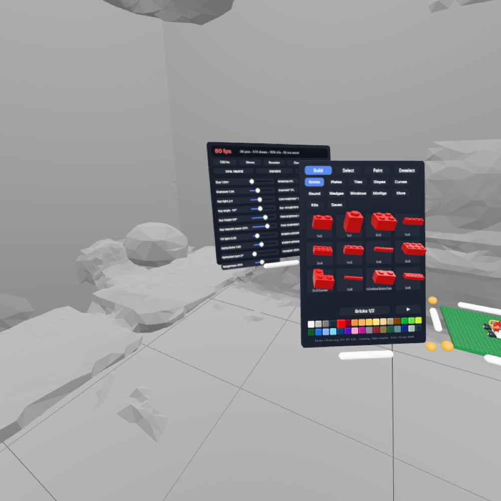

# Stacker docs

Stacker is a mixed-reality brick-building app for Meta Quest 3, built for the browser with WebXR. A platform floats in your room, a library panel holds real brick parts, and you build with your hands or controllers. Kits guide you through official models step by step.

**Live build:** the private Spacefast space `spc_faf94500d20b4e979a35db4ede374b64` (open the preview link on the Quest). **Code:** [`app/`](../app). **Data tools:** [`tools/`](../tools).

## Read in this order

| Doc | What's in it |
|---|---|
| [01 · Vision & status](01-vision.md) | What Stacker is for, what's built, what's next |
| [02 · Architecture](02-architecture.md) | Stack, repo layout, how the runtime is organized |
| [03 · Interaction](03-interaction.md) | Input, grabbing, snapping, tools, panels — plus the controls cheat sheet |
| [04 · Parts pipeline](04-parts-pipeline.md) | LDraw + Rebrickable → `parts.bin`, colors, minifigs |
| [05 · Kits](05-kits.md) | Kit format, converting LDraw models, ghosts, shelf, manual |
| [06 · Rendering & performance](06-rendering-and-performance.md) | Instancing, materials, lighting, look presets, perf budget |
| [07 · Development](07-development.md) | Running, emulator testing, deploying, licensing |
| [08 · Decisions](08-decisions.md) | Why things are the way they are |

## Status (2026-09-30)

Working prototype, tested in the IWSDK Quest 3 emulator and by hand on device:

- 300 LDraw parts in 11 library tabs (incl. Special: hinges, turntables, SNOT), 32 official colors, 6 minifig presets
- Connector snapping: studs and sockets in any orientation, free rotation, joint pairs (hinges, turntables, window glass)
- Build / Select / Paint tools, duplicate, delete, group moves
- Movable, tiltable, resizable platform; movable, resizable library with 3 materials (plastic, wood, clear)
- Settings panel: 6 look presets up front; environments, tone, Hz, Stress and fine-tune sliders under Advanced
- Splash screen with loading progress; **desktop view** (mouse + keyboard) for exploring and testing without a headset
- Undo/redo (50 steps); confirm taps on Clear, Stress and starting a kit over a build
- Seven kits (House, Go-Kart, Robot, Sea Plane, Turbo Prop, Pizza To Go, Fire Station) on a rack of 3D boxes: grab one, review it, tear the strip to start; ghost guidance, a parts shelf, and a paged manual
- Autosave plus 6 save slots
